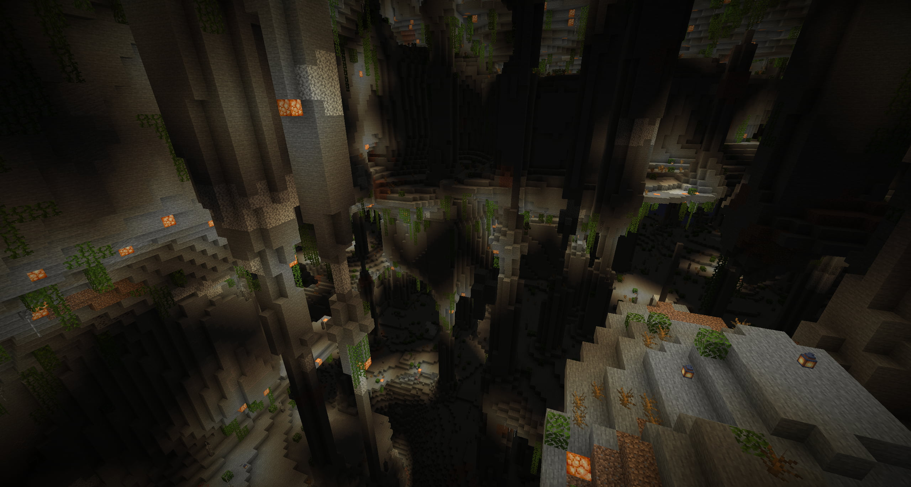
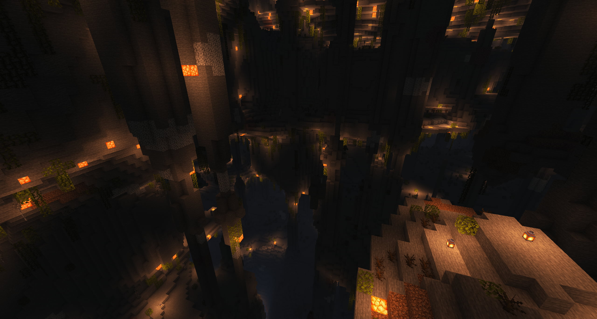
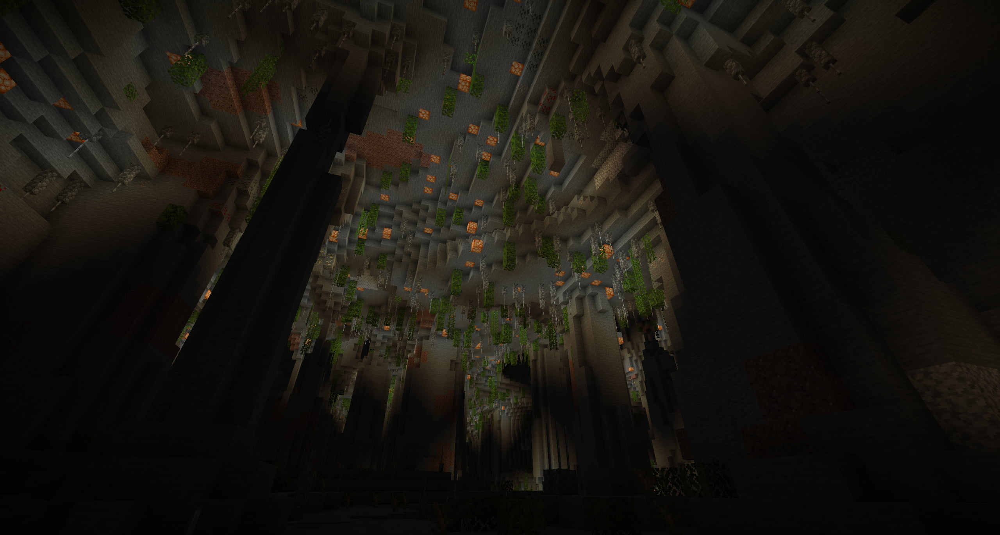
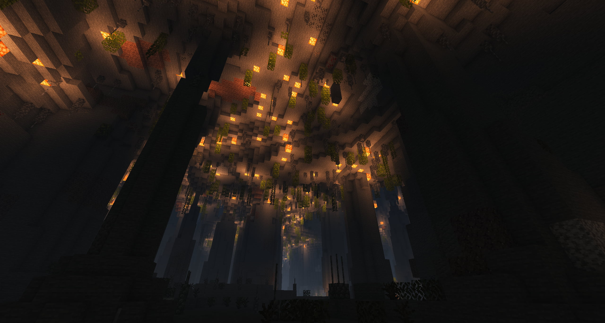
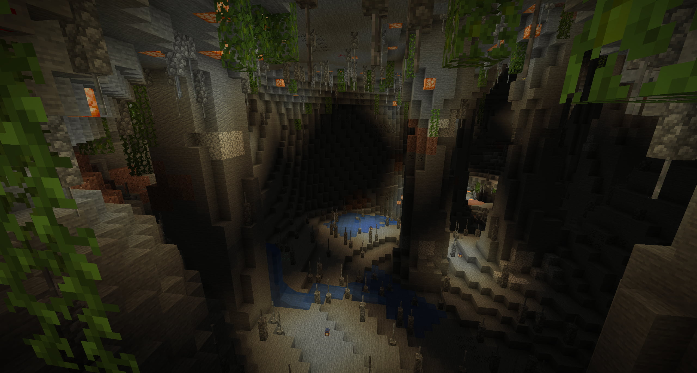
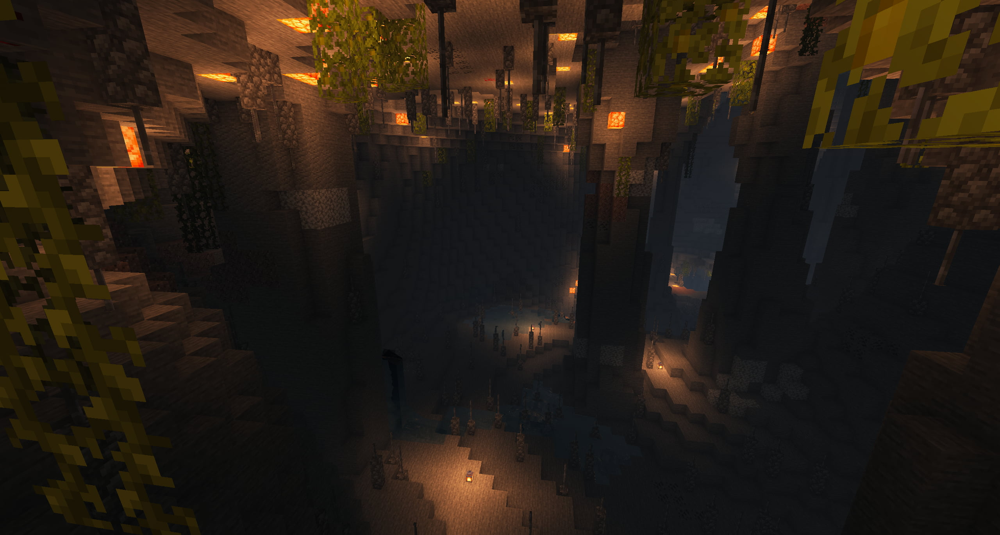
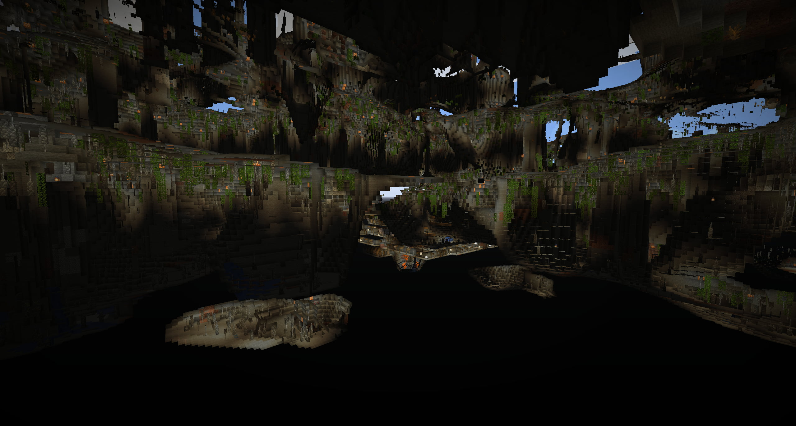
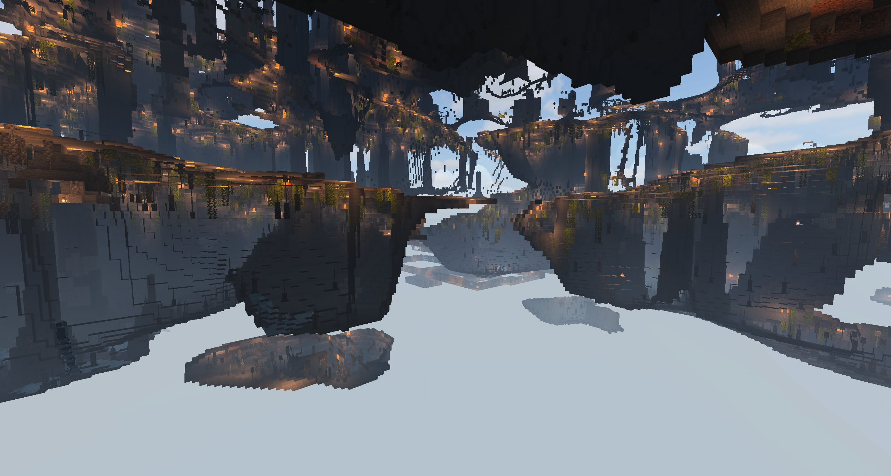

# TerraCaves

A caves-only world pack for the Minecraft world generation plugin [Terra](https://github.com/PolyhedralDev/Terra).

The goal is to provide a world just for mining ores.

Note: This is still a work in progress and might change entirely in the future. Suggestions and contributions are welcome.

## Screenshots

Normal | Shader - [projectLUMA](https://www.curseforge.com/minecraft/customization/projectluma)
------ | ------
 | 
 | 
 | 
 | 

## Composition

- Layer 0: Bedrock
- Layer 1: Mostly Bedrock
- Layer 2: Half Bedrock
- Rest: mostly Stone
- Deposits
  - Dirt
  - Gravel
  - Diorite
  - Andesite
  - Granite
- Ores
  - Coal Ore (6-128)
  - Iron Ore (6-128)
  - Gold Ore (6-128)
  - Lapis Ore (6-100)
  - Redstone Ore (6-100)
  - Diamond Ore (6-80)
  - Emerald Ore (6-70)
- Decorations
  - Single Lava Sources (10-25)
  - Single Water Sources (20-42)
  - Lanterns (20-255)
  - Shroomlights (8-200)
  - Leaves
  - Vines
  - Dead Bushes
  - "Stalactites", "Stalagmites" and "Small Rocks"
- Structures
  - Dungeons
  - Mineshafts

## Installation

0. [Install Terra](https://github.com/PolyhedralDev/Terra/wiki/Quick-Start-Guide)
1. [Install this Terra pack](https://github.com/PolyhedralDev/Terra/wiki/Config-Packs#how-do-i-install-a-pack)

## Usage

See [Terra documentation](https://github.com/PolyhedralDev/Terra/wiki/Creating-a-Terra-World).

If you're using [Multiverse](https://dev.bukkit.org/projects/multiverse-core), you can create a world with:
`/mv create <wold name> NORMAL -g Terra:CAVES`

## Links

Links that might be interesting:

- [Terra ore configuration](https://github.com/PolyhedralDev/Terra/wiki/Ore-Configuration)
- [Pre 1.17 default ore distribution](https://minecraft.fandom.com/wiki/Ore/Pre-1.17_distribution)

## Credit

Based on:
- [Astrashh/TerraCaveTest](https://github.com/Astrashh/TerraCaveTest) by [@dfsek](https://github.com/dfsek) and [Contributors](https://github.com/PolyhedralDev/TerraDefaultConfig/graphs/contributors)
- [PolyhedralDev/TerraDefaultConfig](https://github.com/PolyhedralDev/TerraDefaultConfig/tree/master/default) by [@Astrashh](https://github.com/Astrashh) and [Contributors](https://github.com/Astrashh/TerraCaveTest/graphs/contributors) (Licensed under [CC BY 4.0](https://creativecommons.org/licenses/by/4.0/))

## Licensing

Terra Caves is licensed under a Creative Commons Attribution 4.0 International License.

You should have received a copy of the license along with this work.
If not, see [creativecommons.org/licenses/by/4.0/](https://creativecommons.org/licenses/by/4.0/).

